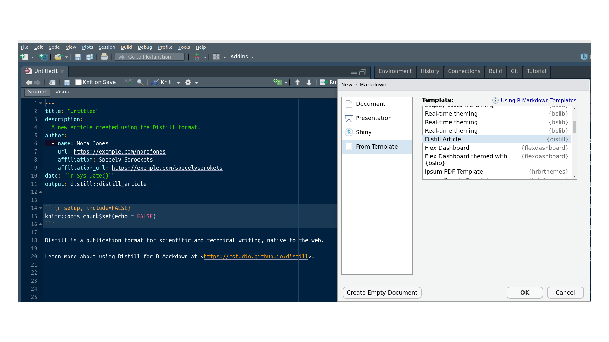

```{r setup, include=FALSE}
knitr::opts_chunk$set(echo = TRUE)

# colores
c0= "#b0394a"
c1= "#ad6395"
c2= "#a391c4"
c3= "#8acfe6"
c4= "#646420"
c5= "#db524f"
```


#  **Descripción actividad ** 

<br/><br/>

# **Construcción de un artículo**

<br/>

## **Paso 1**

En un formato  **Rmd** deberan construir un documento que contenga las principales caracteristicas de la distribución asignada **a cada estudiante**


```{r, echo=FALSE, out.width="100%", fig.align = "center"}

```

**Nota**: para tenerlo disponeble es necesario cargar el paquete **distill**

El encabezado el Rmd seria :

```{r, eval=FALSE}
---
title: "Titulo del articulo"
description: |
  Descripcion del articulo.
author:
  - name: Daniel Enrique Gonzalez Gomez
date: 2022-09-26
preview: imagen.png
output:
  distill::distill_article:
    self_contained: false
---
```

La imagen en formato png corresponde a la imagen que acompaña al articulo


<br/><br/>

## **Paso 2**

Cada estudiante aportará al trabajo realizado por uno de sus compañeros mediante dos contribuciones:

* **plus** : realizará por lo menos un aporte que permita mejorar el trabajo sustancialmente y que aun no está claramente incorporado al trabajo

* **delta** : dentro de los elementos contemplados en el trabajo deberá realizar sugerencias que lo potencie para un mejor resultado


<br/><br/>

## **Contenido del artículo**

* Origen de la distribución
* Características principales : f(x), F(x), E[X], V[X], representación gráfica....
* Ejemplo con enunciado, solución y sintaxis en R
* Aplicaciones en el campo de las ingeniería, ciencias, economía, salud...
* Relaciones entre distribuciones nivariadas. [(Artículo)](http://www.stat.rice.edu/~dobelman/courses/texts/leemis.distributions.2008amstat.pdf)

* Referencias bibliográficas 

<br/><br/><br/>

## **Tabla 1**

### **Asignación de distribuciones** 

<br/><br/>

|num         | Distribución     |   num  |  Distribución         |
|:----------:|:-----------------|:-------| :---------------------|
| 1          | binomial   	    | 2      | Poisson               |	
| 3          | hipergeométrico  | 4      | geométrico o de Pascal|	
| 5          | binomial negativo| 6      | uniforme              |	
| 7          | normal	          | 8      | exponencial           |	
| 9          | gamma	          | 10     | Weibull               |
| 11         | Cauchy           | 12     | lognormal	           |
| 13         | beta             | 14     | Erlang	               |
| 15         | Gumbel	          | 16     | logistic              |


La asignación se realizará por sorteo en sesión de clase el dia lunes 25 de septiembre de 2022. A los estudiantes no presentes el profesor realizará la asignatura de la distribución

<br/><br/>

## **Fechas** 

* Revisión por parte de pares (paso 2) : septiembre 30  2022
* Entrega del artículo final : octubre 3 de 2022

Los documentos resultantes serán publicados en un blog para la revisión de todos

<br/><br/><br/>

## **Asignación de distribuciones**

<br/>

## **Tabla 2**

### **Asignacion de id por estudiante**

<!-- | id | nombre                           |id   | nombre                    | id  | nombre                          | -->
<!-- |:---|:---------------------------------|:----|:--------------------------|:----|:--------------------------------| -->
<!-- | 1  |Ramirez Gutierrez Emerson Armando	| 13	|Cordoba Narvaez Alejandro	| 25	|Garces Sanmartin Saray         	| -->
<!-- | 2	 |Trejos  Marulanda Joan Estibens	  | 14	|Valencia Amaya Santiago	  | 26	|Vasquez Pinilla Jean	            |  -->
<!-- | 3	 |Guerra Segura Laura	              | 15	|Peña Molina David	        | 27	|Gaitan Zambrano Luis	            | -->
<!-- | 4	 |Montero Guzman Marlon	            | 16	|Garzon Fajardo Juliana	    | 28	|Betancourth Zapata Maria Camila	| -->
<!-- | 5	 |Montaño Lopez Santiago	          | 17	|Garcia Polanco Juan	      | 29	|Muñoz Rodriguez Yeison	          | -->
<!-- | 6	 |Lozano Escobar Juan	              | 18	|Torres Martinez Dana	      | 30	|Torres Murcia Brenda	            | -->
<!-- | 7	 |Olarte Lopez Camila	              | 19	|Hurtado Bustos Sebastian	  | 31	|Valencia Garcia Juan	            | -->
<!-- | 8	 |Gonzalez Mejia Isabella	          | 20	|Herran Robledo Alejandra	  | 32	|Vargas Garcia Alvaro	            | -->
<!-- | 9	 |Quintero Moreno Gabriela	        | 21	|Izquierdo Cabrera Daniel	  | 33	|Valencia Sanchez Jesus	          | -->
<!-- | 10 |Rico Aragon Gabriel	              | 22	|Andrade Vargas Jose	      | 34	|Caicedo Garcia Heber	            | -->
<!-- | 11 |Lopez Abella Juan	                | 23	|Lozano Arcila Maria	      | 35	|Marin Hincapie Juan	            | -->
<!-- | 12 |Valencia Piedrahita Maria	        | 24	|Ruiz Calero Santiago	      |	36  |EscobarIsaac                     | -->
<!-- |37  | Chapid Willian David             |     |                           |                                       | -->

<br/><br/>

## **Tabla3**

### **Asignación de distribución por id**

<!-- |	id   |  modelo| id   |modelo  | id   |modelo  | -->
<!-- |:----:|:------:|:----:|:------:|:----:|:------:| -->
<!-- |	1	   |	9	    |	13	 |	10	  |	25	 |	10	  | -->
<!-- |	2	   |	14	  |	14 	 |	15	  |	26	 |	1	    | -->
<!-- |	3	   |	11	  |	15	 |	1	    |	27	 |	5	    | -->
<!-- |	4	   |	2	    |	16	 |	2	    |	28	 |	8   	| -->
<!-- |	5  	 |	7	    |	17	 |	9	    |	29	 |	3	    | -->
<!-- |	6	   |	3	    |	18	 |	12	  |	30	 |	11	  | -->
<!-- |	7	   |	16	  |	19	 |	4	    |	31	 |	12  	| -->
<!-- |	8	   |	4	    |	20	 |	7	    |	32	 |	5	    | -->
<!-- |	9	   |	16	  |	21	 |	6	    |	33	 |	7	    | -->
<!-- |	10	 |	3	    |	22	 |	15	  |	34	 |	14 	  | -->
<!-- |	11	 |	6	    |	23	 |	13	  |	35	 |	5	    | -->
<!-- |	12	 |	8	    |	24	 |	1	    |	36	 |	13	  | -->
<!-- |      |        |      |        | 37   |   8    | -->


<br/><br/>

<!-- **Nota**:  -->

<!-- Como ejemplo da la asignación de los modelos, el **id = 1** corresponde al primer estudiante de la **Tabla 2** le corresponde el **modelo 9 : gamma** de la **Tabla 1**. Lo cual indica que a Emerson Ramirez le corresponde realizar un artículo sobre el modelo gamma -->


