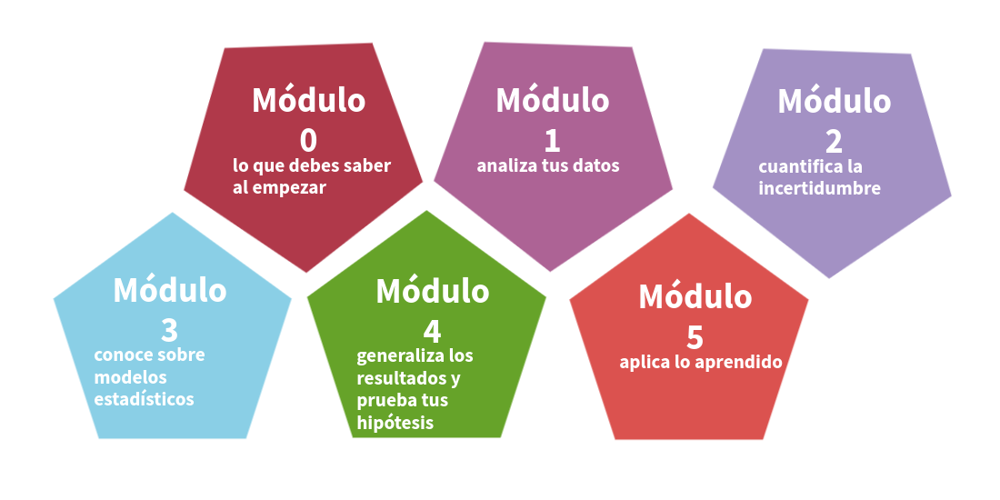
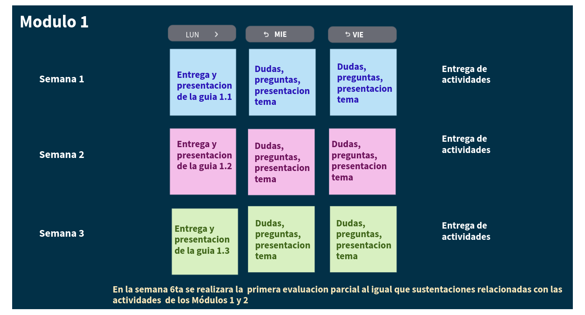
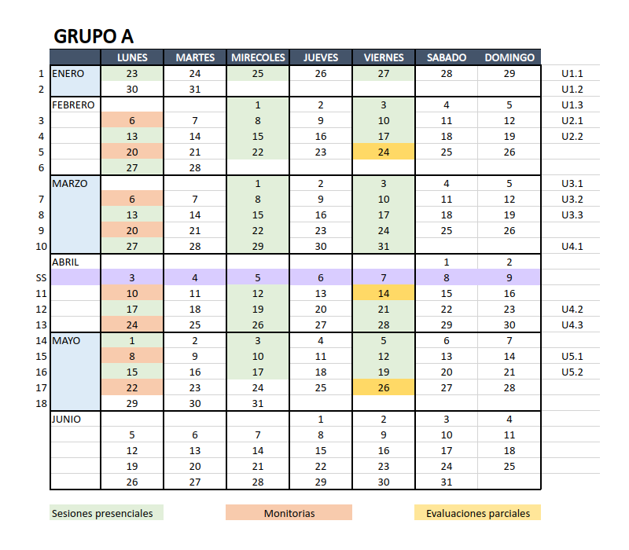
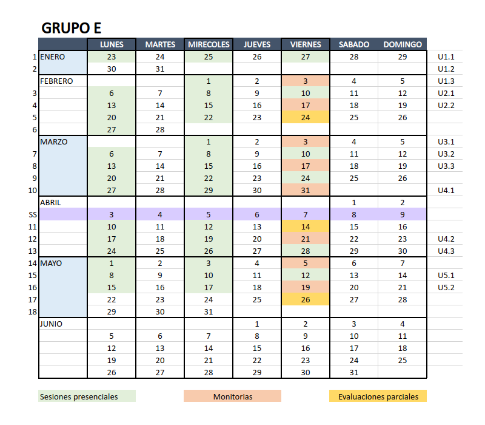
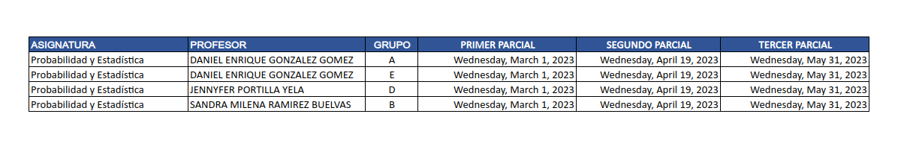

```{r setup, include=FALSE}
knitr::opts_chunk$set(echo = TRUE)
cg="#6c4675"

```

# **300MAE005**

<br/><br/>


```{r, echo=FALSE, out.width="100%", fig.align = "center"}
knitr::include_graphics("img/bannerG.png")
```


<br/><br/><br/>


```{r, echo=FALSE, out.width="100%", fig.align = "center"}
 
```
<br/><br/>

# **Metodología**
 
```{r, echo=FALSE, out.width="100%", fig.align = "center"}

```
<br/><br/><br/>


# **Calendario 2023-1**

<br/><br/>
<!-- # **Salones de clase** -->

## **300MAE005 grupo A**

```{r, echo=FALSE, out.width="100%", fig.align = "center"}

```

<br/><br/>

## **300MAE005  grupo E**

```{r, echo=FALSE, out.width="100%", fig.align = "center"}

```

<br/><br/>


# **Parciales**


```{r, echo=FALSE, out.width="100%", fig.align = "center"}

```

# **Atención a Estudiantes**


```{r, echo=FALSE, out.width="100%", fig.align = "center"}
# knitr::include_graphics("img/calendario2023-1bre.png")
```

<br/><br/>

# **Información supletorios**


```{r, echo=FALSE, out.width="100%", fig.align = "center"}
# knitr::include_graphics("img/calendario2023-1bre.png")
```

<br/><br/>


```{r, echo=FALSE, out.width="100%", fig.align = "center"}
# knitr::include_graphics("img/calendario2023-1bre.png")
```

# **Salones de clase**

|                      | 300MAE005 A                         | 300MAE005 E         |
|:---------------------|:------------------------------------|:--------------------|
| LUNES                | ALM 1.7                             |  LG 3.2             |  
| MIERCOLES            | ALM 1.5                             |  LG 1.5             |
| VIERNES              | ALM 1.7                             |  LG 2.0             |


