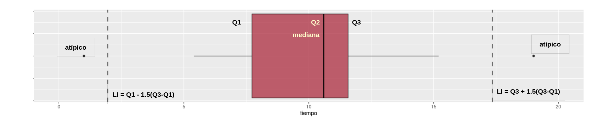

```{r setup, include=FALSE}
knitr::opts_chunk$set(comment = NA)

library(RColorBrewer)
library(summarytools)
library(knitr)
library(readxl)
library(tidyverse)
# Colombia<- readRDS("data/Colombia.RDS")
# 
#install.packages('remotes')  # solo una vez
library(remotes) # solo una vez
# install_github("dgonxalex80/paqueteDEG", force = TRUE) # solo una vez
library(paqueteDEG)
data(Colombia23)
# colores
c0= "#b0394a"
c1= "#ad6395"
c2= "#a391c4"
c3= "#8acfe6"
c4= "#646420"
c5= "#db524f"

library(readr)
futbol <- read_csv("data/futbol.csv")
```


<br/><br/>


### **¿Que es un indicador?**

<br/><br/>


<br/><br/>

Cuando nos subimos a un auto  observamos un tablero con muchos indicadores que permiten al conductor validar el estado del vehículo. Todos los podemos visualizar al tiempo con el fin de darnos una idea del nivel de combustible, la temperatura, el estado de la batería, si alguna puerta esta abierta, la velocidad a la que se viaja, entre otros.

<br/>

Al igual que la situación anterior cuando nos enfrentamos a una análisis de datos, requerimos resumirlos en indicadores, tablas y gráficos que nos permitan un fácil análisis de ellos

<br/> <br/> <br/>

Tomaremos una base de datos de la FIFA para analizar indicadores de las selecciones de futbol asociadas a 6 confederaciones.

```{r}
library(DT)
DT::datatable(head(futbol, 218),fillContainer = FALSE, options = list(pageLength = 8))
```
portal FiveThirtyEight : https://data.fivethirtyeight.com/

<br/> <br/> <br/>

## **Tablas de frecuencia** 


 <br/>
 
### **Tablas de frecuencia para variables cualitativas**

<br/>
<br/>

Las distribuciones de frecuencia o también llamadas tablas de frecuencia nos sirven para agrupar los datos y así permitir resumir para poder tener una idea mas clara de sus características.

Para las variables cualitativas la tabla posee 3 columnas : 

+ c1: los diferentes valores que toma la variable. 

+ c2:  **frecuencia absoluta** que consiste en el conteo para cada uno de los valores distintos que toma la variable. 

+ c3: **frecuencia relativa ** que corresponde  al porcentaje la cantidad de datos para cada los valores


 <br/> <br/>

```{r, echo=TRUE, message=FALSE, warning=FALSE}
library(readr)
futbol <- read_csv("data/futbol.csv")
# Forma simple
table(futbol$confed)
```
 
 <br/> <br/>

```{r, message=FALSE, warning=FALSE}
#utilizando summarytools
confederacion=as.factor(futbol$confed)
summarytools::freq(confederacion, cumul = FALSE)
```

Nota: paquete [summarytools](https://cran.r-project.org/web/packages/summarytools/vignettes/Introduction.html) 

 <br/> <br/>
 
### **Tablas de frecuencia para variables cuantitativas**

Para las variables cuantitativas las tablas de frecuencias tiene una presentación diferente a la vista anteriormente. Como se trata de variables con una gran número de valores diferentes, es necesario dividirlas por intervalos .

Cuando tenemos los datos sin agrupar nos es difícil extraer información que nos permita hacer un análisis de los mismos

```{r}
futbol$off
```

Una primera aproximación pude ser el diagrama de tallos y hojas con consiste en separar los dígitos de los datos en dos : una primera parte que se repite llamada tallo y otra parte que tiene diversos valores. Este diagrama también nos permite ordenar los datos de menor a mayor

```{r}
stem(futbol$off)
```

Una forma de construir una tabla de freciencias por intervalos es utilizando la funcion `graph.freq` del paquete agricolae

```{r,  echo=TRUE, message=FALSE, warning=FALSE}
library(agricolae)
h2=with(futbol,graph.freq(off,plot=FALSE))
t2=table.freq(h2)
colnames(t2) = c("  LI  ", "  LS  ", "marca clase'", "Frec.Abs","Frec.Rel", "Frec.Abs.Ac","Frec.Rel.Ac")
t2
```
Frec.Abs : Frecuencia absoluta <br/>
Frec.Rel : Frecuencia relativa <br/><br/>
Frec.Abs.Ac : Frecuencia Absoluta Acumuada <br/>
Frec.Rel.Ac : Frecuencia Relativa Acumulada 

 <br/> <br/>

Si se requiere dividir el rango en intervalos determinados se utiliza la función `cut` 
 
```{r}
c <- cut(futbol$off, breaks = c(0, 0.999, 1.99, 2.99, 3.995, 4))
levels(c) <- c("[0-1)", "[1-2)", "[2-3)", "[3-4)","[4-5]")
table(c)
```
 
 

```{r}
data("iris")
summarytools::freq(iris$Species, cumul = FALSE, headings = FALSE)
```

 <br/> <br/> <br/>
 

 
 
 
## **Rango percentil**

 <br/>
 
Es un número que divide la muestra en dos partes. $x$ % de los datos de la muestra son iguales o menores que $P_{x}$ y un $(100-x)$ % por encima  de el.


 <br/>
 
 Para ilustrar el concepto, pensemos en que participamos de una carrera y que el grupo está conformado por 100 corredores.  El percentil dará cuenta de mi posición dentro del grupo. Por ejemplo si mi posición en la carrera en orden de llegada es la décima, indica que por detrás de mi están 90 atletas. Indica esto que soy el percentil 90 ($P_{90}$).
 
 <br/> <br/>
 
 
### **Reto :** 
 
 Que significado tiene :
 
  <br/>
  
+ Participar en una carrera **K10** y ocupar el percentil 30 : $P_{30}$

+ Una nota en un examen de matemáticas ocupó el percentil 90 : $P_{90}$

+ Que significa: $P_{25}$ ; $P_{50}$ ;  $P_{75}$


 <br/> <br/> <br/>
 
### **Diagrama de cajas** 

 <br/>
 
 
```{r, echo=FALSE, out.width="100%", fig.align = "center"}

```

```{r, warning=FALSE, message=FALSE, fig.height=5, fig.width=8} 
# p=ggplot(futbol, aes(x=off))+geom_boxplot(fill = "#b0394a",           # Color caja
#                alpha = 0.3,        # Transparencia
#                color = "#000000",          # Color del borde
#                outlier.colour = "#000000") # Color atípicos
# 
# p + geom_text(data = NULL, x = 1.5, y = 0.4, label = "Q3",col="#b0394a")+
#     geom_text(data = NULL, x = 1.03, y = 0.4, label = "Q2 = mediana",col="#b0394a")+
#     geom_text(data = NULL, x = 0.65, y = 0.4, label = "Q1",col="#b0394a") +
#     geom_text(data = NULL, x = 0.2, y = 0.4, label = "mín",col="#b0394a") +
#     geom_text(data = NULL, x = 3.5, y = 0.4, label = "máx",col="#b0394a") +
#     geom_text(data = NULL, x = 3, y = 0.4, label = "atípicos",col="#b0394a") +
#     geom_text(data = NULL, x = 1.166468, y = 0, label = "*  media",col="#b0394a")# +
#  #   geom_text(data = NULL, x = 1.2, y = 0.4, label = "media",col="#b0394a")
   
```

 <br/>
 
atípico | $LI=Q_{1}- 1.5(Q_{3}-Q_{1})$ | $Q_{1}$ | $Q_{2}$ | $Q_{3}$ | $LS=Q_{3}+ 1.5(Q_{3}-Q_{1})$ |  atípico 

 <br/> <br/> <br/>
 
 
 Con ayuda del diagrama de tallos y hojas es posible ubicar los percentiles en un conjunto de datos
 
```{r}
stem(futbol$off)
```
 <br/> <br/>
 
En este caso el valor mínimo corresponde a 0.20 y el máximo a 3.44

 <br/> <br/>
 
Ahora determine en este diagrama los percentiles :

+ $P_{25}$
+ $P_{50}$
+ $P_{75}$
+ $P_{10}$

Es más rápido utilizando la función de R : `quantile`

```{r}
quantile(futbol$off, c(0.25,.50,0.75,0.10))
```
 
 <br/> <br/>
 
 ### **Renumen**
 
 |                |                                                            |
 |:---------------|:-----------------------------------------------------------|
 | Percentiles    | Divide la muestra en 100 partes de igual porcentaje, cada una con un 1%. $P_{1}, P_{2}, \dots P_{99}$ |
 | Deciles        | Dividen la muestra en 10 parte de igual porcentaje,  cada una con un 10%. $D_{1}, D_{2}, \dots D_{9}$ |
 | Quintiles      | Dividen la muestra en 5 partes de igual porcentaje, cada una con un 20%. $K_{1}, K_{2}, K_{3}, K_{4}$ |
 | Cuartiles     | Dividen la muestra en 4 partes de igual porcentaje, cada una con un 25%. $Q_{1}, Q_{2}, Q_{3}$ |
  
 
  <br/> <br/>
  
## **Indicadores de los Datos**

 <br/> <br/>
 
| Central                    | Dispersión                   | Forma                          |
|:---------------------------|:-----------------------------|:-------------------------------|
| media                      | rango                        | sesgo o asimetría              |
| mediana                    | varianza                     | curtosis                       |
| moda                       | desviación estándar          |                                |
| media truncada             | coeficiente de variación     |                                |
| rango medio                |                              |                                |
| media armónica             |                              |                                |
| media geométrica           |                              |                                |
| media ponderada            |                              |                                |
 

 <br/> <br/>

## **Indicadores de Centro**

### **Media aritmética** 

 <br/>
 
$$\bar{x}= \frac{1}{n} \sum_{i=1}^{n} x_{i}$$

 <br/>
 
Es una de los indicadores estadísticos mas conocidos

Propiedades de la media :

+ La suma de las desviaciones de los datos con respecto a la media es cero. $\sum (x_{i}-\bar{x})=0$.

+ La suma de los cuadrados de las desviaciones de los datos con respecto a un valor $a$ es mínimo cuando $a=\bar{x}$.

+ Si $x_{i}=k$ para todo $i$, entonces, $\bar{x}=k$.

+ Si a todos los datos de una variable se le suma una constante $k$, es decir  $y_{i}=x_{i} + k$, entonces $\bar{y}=\bar{x} +k$

+ Si todos los datos de una variable se multiplican por una constante $k$, es decir $y_{i}=kx_{i}$, entonces $\bar{y}=k\bar{x}$

+ Si $z_{i}=a x_{i}+b y_{i}$, donde: *a*, *b* constantes y $x_{i}$, $y_{i}$ variables, entonces: $\bar{z}=a\bar{x}+b\bar{y}$. 

 <br/> <br/>
 
**Ejemplo 1**

El promedio de el rendimiento de millas por galón de combustible del grupo de autos observados es de $20.09$ mpg

```{r}
mean(mtcars$mpg,na.rm = TRUE)
```

 <br/> <br/>

**Ejemplo 2**

El valor promedio de poder ofencivo de las selecciones de futbol asociadas a la FIFA es de 1.16

```{r}
mean(futbol$off, na.rm = TRUE)
```

 <br/> <br/>
 
**Ejemplo 3**

El promedio del conjunto de números enteros entre uno y diez es 5.5 

```{r}
x=1:10
x
cat("media :",mean(x))


```


 <br/> <br/>
 
 **Ejemplo 4**

Surge el problema a que se puede tener es este indicador cuando uno de sus datos cambia drásticamente, por ejemplo si se cambia el último datos (10) por otro valor como 100 entonces, que pasaría con la media ?

En este caso el promedio se eleva a 14.5 por el cambio realizado. Esto puede suceder en algunos casos donde trabajamos información que puede presentar datos extremos o atípicos

```{r}
x=1:10
x[10]=100
x
cat("media :" ,mean(x))
```

 <br/> <br/>
 
### **Mediana** 

**Me** :Es el número que divide la muestra en dos partes de igual proporción (50% : 50%). Es decir que corresponde a:

$$P_{50} = D_{5} = Q_{2}$$

también corresponde a la linea central del diagrama de cajas.

```{r}
median(futbol$off,na.rm = TRUE)
```

 <br/> <br/>
 
```{r, warning=FALSE, message=FALSE, fig.height=3, fig.width=7}
boxplot(futbol$off, las=1, horizontal = TRUE, col = c1)
```
 
 <br/> <br/>
 
La **Me** corresponde a la linea central de a caja en el diagrama de cajas


La mediana es mas robusta a los cambio en los datos extremos. En presencia de datos atípicos es mejor utilizar la mediana en lugar que la media.

```{r}
x=1:10
x
cat("media :" ,median(x))
```

 <br/> <br/>
 
```{r}
x[10]=20
x
cat("media :" ,median(x))
```

 <br/> <br/>

### **Moda**  

**Mo** : Dato o valor que más se repite. Es utilizada como medida de tendencia central en variables cualitativas o o en cuantitativas discretas con pocos valores. En una tabla o  gráfico se puede distinguir fácilmente. 

```{r, message=FALSE}
#utilizando summarytools
summarytools::freq(futbol$confed, cumul = FALSE, headings = FALSE)
```

moda : **UEFA**, es la confederación con más selecciones nacionales de futbol ascritas

 <br/> <br/>
 
### **Otras medidas de centro**

 <br/> <br/>
 
### **Media truncada**

Con el fin de evitar que los datos atípicos generen sesgos en el indicador de la media, es posible separar el 90% de los datos, quitando un 5% de los datos mas pequeños y un  5% de los datos mayores. A este indicador de le llama media truncada al 10%  ($\bar{x}_{_{0.10}}$)

 <br/> <br/>
 
```{r, warning=FALSE, message=FALSE}

mean(futbol$off, na.rm = TRUE, trim = 0.10)
```

 <br/> <br/>
 
### **Rango medio**  

$$\frac{1}{2}\big(max(x)+min(x)\big)$$


```{r, warning=FALSE, message=FALSE}
(max(futbol$off,na.rm = TRUE)+min(futbol$off,na.rm = TRUE))/2
```

La diferencia entre el equipo con mas poder ofencivo y el equipo como menor valor es de 1.87 puntos. 
 <br/> <br/>
 
###  **Media geométrica** 

Este indicador de tendencia central se utiliza para promediar tasa de crecimiento o de interés. Para encontrar su valor se multiplican los valores de $n$ tasas incrementadas en uno ($1+r$). A ese producto se le extrae la raíz n-esima.

$$MG = \Bigg(\displaystyle\prod_{i=1}^n (r_{i}+1)\Bigg)^{1/n}$$

 <br/> <br/>

###  **Media armónica**  


$$H = \dfrac{1}{\frac{1}{x_{1}}+\frac{1}{x_{2}}+ ... + \frac{1}{x_{n}}}  $$

Este indicador corresponde al inverso de la media aritmética 

 <br/> <br/>
 
### **Problema reconocimiento de grupo**

Spongaos que solo se nos dice que un grupo conformado por 4 personas tiene un promedio de edad de $20$ años. Todos inicialmente suponemos que se trata de cuatro jóvenes que tienen edades cercanas a $20$ años. Pero  puede ocurrir que estemos lejos de acertarlo, pues existen multiples combinaciones de edades que tienen como promedio $20$ años. 

Por ello es necesario tener más informacion sobre el grupo.

|                             |                                    |
|:----------------------------|:-----------------------------------|
|**Grupo 1**                  |**Grupo 2**                         | 
|Edades : 19, 22, 18, 21      |Edades : 39, 38, 2, 1               |
|Promedio : 20 años           |Promedio : 20 años                  |
|                             |                                    |


Hace falta otro indicador que nos oriente de cual grupo hablamos cuando solo tenemos como información : media = $20$ años. Esta necesidad la suplen los `indicadores de dispersión`.

 <br/> <br/>
 
## **Indicadores de Dispersión**

### **Rango**

$r = max(x) - min(x)$

En caso de los dos grupos:

|**Grupo 1**                  | **Grupo 1**                        |
|:----------------------------|:-----------------------------------|
|$\bar{x} = 20$ años          |$\bar{x} = 20$ años                 |
|$r = 4$ años                 |$r = 38$ años                       |  
|                             |                                    |


Es importante hacer notar que si además de la media conocemos tambien un indicador de dispersión, en este caso el rango, podemos intuir si se trata del primero o segundo grupo. El ranto es un indicador muy útil cuando se deben realizar cálculos rápidos.

 <br/> <br/>
 
### **Varianza**

Es la medida de dispersión más utilizada en estadística y está definida por 

$$s^{2}=\frac{1}{n-1} \sum_{i=1}^{n} (x_{i}-\bar{x})^{2}$$

 <br/> <br/>
 
#### **Propiedades de la varianza**

+ $s^{2} = \frac{1}{n} \sum x_{i}^{2}- (\bar{x})^{2}$ 

+ La varianza es siempre no negativa  $s^{2} >=0$

+ La varianza de una constante es cero $s_{k}^{2}=0$

+ Si $y_{i}= x_{i} + k$, entonces $s_{y}^{2}= s_{x}^{2}$

+ Si $y_{i}=k x_{i}$, entonces $s_{y}^{2}= k^{2} s_{x}^{2}$

+ Si $y_{i}=x_{i} + k$ , entonces  $s_{y}^{2} = s_{x}^{2}$

+ Si $z_{i} = a x_{i} + b y_{i}$, entonces $s_{z}^{2}$ = $a^{2}s_{x}^{2}$ + $b^{2}s_{y}^{2}$ + $2ab$ $cov(xy)$

La varianza se puede interpretar como el promedio de las diferencias cuadradas entre cada uno de los datos y la media

El problema de la varianza es su **interpretación**

Sus unidades son al cuadrado y en la mayoría de los casos no es posible interpretarlos. Por esta razón se optó por utilizar otra mediada de dispersión

 <br/> <br/>
 
### **Desviación estándar** 

Es la raíz cuadrada de la varianza

$$s=\sqrt{s^{2}}$$

**Nota** : no aplican todas las propiedades de la varianza

```{r}
cat( "Varianza :",var(futbol$off), "\n" )
cat("Desviación estándar :",sd(futbol$off))
```

Aunque la desviación estándar reduce el problema debido a tener las mismas unidades de la variable, es útil para comparación de dos grupos

 <br/> <br/>
 
### **Coeficiente de variación**

Nos indica que tan grande o que tan pequeña es la desviación estándar con respecto a su media

$$CV= \dfrac{s}{\bar{x}} \times 100 \% $$

Existen diferentes reglas empíricas para la interpretación del coeficiente de variación. Una de ellas establece como límite el 20% para separar los grupos homogéneos de los heterogéneos Por lo general se utiliza un valor hasta el 20% para determinar que un grupo de datos son homogéneos, de lo contrario se calificará como heterogéneo.

```{r}
cat("Coeficiente de variación :",sd(futbol$off)/mean(futbol$off)*100, " %")
```

En este caso se obtiene un valor muy alto del coeficiente de variación lo cual indica que los datos en este caso el poder ofencivo de los equipos es alta, pudiendo calificar esta variable como heterogenea


 <br/> <br/>
 
## **Indicadores de Forma**

<br/>

### **Curtosis**

Se mide a través del coeficiente de curtosis que mide cuan **puntiaguda** es una distribución respecto a la curva de la distribución normal entandar.

De acuerdo con su valor, la puntudez de los datos puede clasificarse en tres grupos:

+ <span style="color:#ee3b3b">**Leptocúrtica**</span>, con valores grandes para el coeficiente ( <span style="color:#ee3b3b">**CA>0**</span>)

+ <span style="color:#0000cd">**Mesocúrtica**</span>, con valores medianos para el coeficiente ( <span style="color:#0000cd">**CA=0**</span>)

+ <span style="color:#ee9a00">**Platicútrica**</span>, con valores pequeños para el coeficiente ( <span style="color:#ee9a00">**CA<0**</span>) 

```{r, echo=FALSE, fig.height=3.5, fig.width=9}
# Distribucion normal
library(ggfortify)

p=ggdistribution(dnorm, seq(-5, 5, 0.01), mean = 0, sd = 1,colour = 'blue')
p=ggdistribution(dnorm, seq(-5, 5, 0.01), mean = 0, sd = .7,colour = 'red', p=p)
p=ggdistribution(dnorm, seq(-5, 5, 0.01),   mean = 0, sd = 1.5,colour = 'orange', p=p)
p
```

 <br/> <br/>


$$CA = \dfrac{1}{s^{4}}\Bigg(\dfrac{1}{n} \sum_{i=1}^{n} (x-\bar{x})^{4} \Bigg) - 3$$
<br/><br/>


 
```{r}
rapportools::kurtosis(futbol$off)
```
 
<br/><br/> 
 
### **Asimetría o sesgo**

Mide que tanto la forma de la distribución de frecuencias de los datos es simétrica o no con respecto a la media. Esta característica de los datos se mide a través del coeficiente de asimetría o sesgo.

+ Es <span style="color:#ee3b3b">**simétrica**</span> si el  valor del indicador es 0  ($\bar{x}=Me$)

+ Es <span style="color:#ee9a00">**asimétrica a la izquierda**</span> si el valor del indicador es negativo ($\bar{x}<Me$)

+ Es <span style="color:#0000cd">**asimétrica a la derecha**</span> si el valor del indicador es positivo ($\bar{x}>Me$)


+ **Asimetria negativa ** : Poco con poco, mucho con mucho
+ **Simetrica** : Poco con poco, poco con mucho, mucho al rededor de un centro
+ **Asimetria positiva** : Mucho con poco, poco con mucho

<br/><br/>


$$CA = \dfrac{1}{s^{4}}\Bigg(\dfrac{1}{n} \sum_{i=1}^{n} (x-\bar{x})^{4} \Bigg) - 3$$

<br/><br/>

```{r}
rapportools::skewness(futbol$off)
```

<br/><br/>

El valor obtenido para el sesgos nos indica que existe un mediano sesgo positivo o a la derecha ( mucho con poco - poco con mucho). Este resultado nos indica que muchos equipos tienen bajo nivel ofencivo y unos pocos son los que tienen un alto poder ofencivo.

<br/>

```{r, message=FALSE, warning=FALSE}
summarytools::descr(futbol$off)
```

<br/><br/>

```{r}
summarytools::descr(mtcars$mpg)
```

<br/><br/>


```{r, message=FALSE, warning=FALSE}
d1=density(futbol$off, na.rm=TRUE); plot(d1)
```


```{r, message=FALSE, warning=FALSE}
data("mtcars")
d2=density(mtcars$mpg); plot(d2)

```


 <br/> <br/>
 

<br/><br/><br/>


## **Formulario**

|Estadística             | fórmula                               | código R                      |
|:-----------------------|:--------------------------------------|:------------------------------|
|**centro**              |                                       |                               |
|media aritmética        | $\displaystyle\dfrac{1}{n}\sum_{i=1}^{n} x_{i}$    | `mean(x)`                     |
|mediana                 | $Me = P_{50} = X_{n+1/2}$             | `median(x)`                   |
|moda                    | $Mo$ dato que más se repite           |                               |
|media truncada | media calculada con el 90% central de los datos|`mean(x,trim=10/100)`          |
|rango medio             | $rm=\dfrac{min\{x\}-max\{x\}}{2}$     | `max(x)-min(x)`               |
|media geométrica        | $(x_{1} \times x_{2} \times x_{3} .... x_{n})^{1/n}$  |               |
|media armónica          | $\dfrac{n}{\dfrac{1}{x_{1}}+\dfrac{1}{x_{2}}+\dfrac{1}{x_{3}}+...+\dfrac{1}{x_{n}}}$ | |
|**dispersión**          |                                       |                               |
|rango                   |$r= max\{x\}-min\{x\}$                 |`max(x)-min(x)`                |
|varianza                |$s^{2} = \dfrac{1}{n-1} \displaystyle\sum_{i=1}^{n}(x_{i}-\bar{x})^{2}$  |`var(x)`    |
|desviación estandar     |$s = \sqrt{s^{2}}$                     |`sd(x)`                        |
|coeficiente de variación|$cv= \dfrac{s}{\bar{x}} \times 100$ %  |`sd(x)/mean(x)*100`            |
|**forma**               |                                       |                               |
|coeficiente de curtosis |$\displaystyle\dfrac{Q_{3}-Q_{1}}{P_{90}-P_{10}}$ |`rapportools::kurtosis(bpe$promedio)`|
|coeficiente de asimetría|$\displaystyle\dfrac{3(\bar{x}-Me)}{s}$|`rapportools::skewness(bpe$promedio)`|
|percentil 25            |$X_{n \times 0.25}$                    |`quantile(x,0.25)`             |
|percentil 50            |$X_{n \times 0.50}$                    |`quantile(x,0.50)`             |
|percentil 75            |$X_{n \times 0.75}$                    |`quantile(x,0.75)`             |
|rango intercuartílico   |$Q_{3}-Q_{1}$                          |                          |


 <br/> <br/>


## **Ejemplo**

 <br/> <br/>
 
### **Nivel de ansiedad**


|               |                             |
|:--------------|:----------------------------|    
| | Los siguientes datos corresponden al **nivel de ansiedad** de un grupo de estudiantes de la universidad valorada antes de la presentación del primer examen parcial. El investigador a cargo del proyecto utilizó una prueba para medir el nivel de ansiedad que permite puntajes entre 0 y 100. Los valores inferiores a 50 puntos se consideran como nivel bajo . Entre 50 y 80 , nivel medio y superiores a 80 se consideran altos.|


Otra variable importante en el análisis corresponde a la **facultad** a la que pertence el estudiante

1. Facultad de Ingeniería y Ciencias
2. Facultad de Ciencias Económicas y Administrativas
3. Facultad de Humanidades
4. Facultad de Salud


Los resultados obtenidos se presenta a continuación :

```{r nivel, exercise=TRUE}
nivans=c(28,33,34,36,38,38,41,41,45,45,46,46,47,47,48,48,49,50,51,51,51,52,53,53,
         53,54,54,54,55,55,55,56,56,56,57,57,58,60,61,61,61,62,63,64,64,65,65,65,
         65,65,66,67,67,68,68,68,69,69,69,70,70,71,74,77,77,78,79,79,80,82,85,89,
         90,96,58,90,77,71,41,55,53,65,57,56,68,56,50,36,70,57,41,62,48,67,33,52,
         65,67,79,55,34,46,55,56,47,69,61,54,74,47,64,79,85,61,28,46,65,51,49,45,
         78,96,68,38,77,34,69,69,38,65,63,68,48,53,82,61,51,45,66,65,64,70,89,51,
         54,53,80,54,60,53)

fac=c(2,1,2,2,4,3,4,2,4,2,4,1,1,1,1,1,1,2,3,3,3,3,1,2,1,2,2,1,1,2,3,2,3,2,2,3,3,
      1,1,1,2,1,2,2,2,3,1,1,3,1,4,3,1,3,2,1,2,3,4,3,2,3,4,4,1,3,4,4,2,2,1,4,2,1,
      2,4,1,1,1,3,4,1,1,1,1,1,3,3,3,3,1,1,1,2,2,1,3,1,1,1,3,2,2,2,2,1,2,2,1,3,2,
      1,2,2,2,4,2,1,3,4,1,1,3,1,2,2,2,1,3,3,1,1,2,2,3,3,3,1,4,3,1,2,4,2,2,1,2,3,
      2,2)

data=data.frame(fac, nivans) # forma base de datos 
```


<br/><br/>

### Tablas de frecuencia

+ Construya una tabla de frecuencia que le permita establecer las frecuencias en cada uno de los rangos descritos y analice los resultados obtenidos.

**Primera forma** : Utilizando el paquete  `agricolae` 

```{r}
h2=with(data,graph.freq(nivans,plot=FALSE))
t2=table.freq(h2);
colnames(t2) = c("  LI  ", "  LS  ", "marca clase'", "Frec.Abs","Frec.Rel", "Frec.Abs.Ac","Frec.Rel.Ac")
t2
```

**Segunda forma** : utilizando la función `hist`

```{r}
h=hist(data$nivans, breaks = c(20,29.99,39.99,49.99,59.99,69.99,79.99,89.99,100), plot=FALSE)
LI=round(h$breaks[1:8],0) 
LS=round(h$breaks[2:9],0) 
ni=h$counts
hi=h$counts/150
Ni=cumsum(h$counts)
Hi=Ni/150

t=data.frame(LI,LS,ni,hi,Ni,Hi)
t
```

**Tercera forma** : utilizando la funciones :  `cut` y `cbind`

```{r}
nivans1=cut(data$nivans, breaks = c(20,29.99,39.99,49.99,59.99,69.99,79.99,89.99,100))
t2=table(nivans1)
t2=cbind(t2, t2/sum(t2),cumsum(t2), cumsum(t2)/sum(t2))
colnames(t2)=c("n","h","N","H")
t2
```


+ Cálculos las estadísticas descriptivas del nivel de ansiedad y describa los resultados en un párrafo


```{r}
summarytools::descr(data$nivans)
```
El grupo observado corresponde a un total de 150 estudiantes de las cuatro facultades de la universidad (aun no estaba la Facultad de Habitat) y presentan un valor promedio de 59.5 puntos que corresponde a un nivel medio. Su coeficiente de variación (24%) muestra un poco de heterogeneidad en los valores alcanzados por los estudiantes, mientras que su forma se aproxima a una distribución simétrica

<br/><br/>


Tabla de frecuencias para variables cualitativas  utilizando del paquete `summarytools` la función `freq`

```{r facultad, exercise=TRUE }
data$fac[data$fac==1]="Facultad de Ingeniería y Ciencias"
data$fac[data$fac==2]="Facultad de Ciencias Económicas y Administrativas"
data$fac[data$fac==3]="Facultad de Humanidades"
data$fac[data$fac==4]="Facultad de Salud"
summarytools::freq(data$fac, cumul = FALSE)

```

Los reultados indican una mayor proporción de estudiantes de la Facultad de Ingenieria y Ciencias (34%), mientras que la Facultad de Salud la menor (11.3%)

<br/><br/>

## **Video**

<iframe width="560" height="315" src="https://www.youtube.com/embed/dWVs-M7oCh4" title="YouTube video player" frameborder="0" allow="accelerometer; autoplay; clipboard-write; encrypted-media; gyroscope; picture-in-picture" allowfullscreen></iframe>
<br/><br/>


<br/><br/>

### **Lo podemos lograr...**
#### Daniel Enrique González Gómez 

Imagen tomada de : https://pixabay.com/es/images/search/paisaje/


