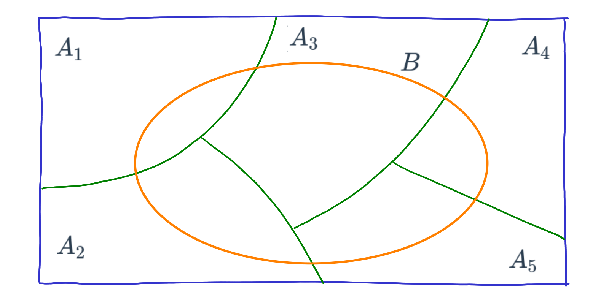

```{r setup, include=FALSE}
knitr::opts_chunk$set(echo = TRUE, comment = NA)
library(tidyverse)
#Colombia<- readRDS("data/Colombia.RDS")


# colores
c0= "#b0394a"
c1= "#ad6395"
c2= "#a391c4"
c3= "#8acfe6"
c4= "#646420"
c5= "#db524f"
```


<br/><br/>

En la guía 2.1 se habló de los conceptos básicos (Experimento aleatorio, Espacio muestral y Evento aleatorio), de los diferentes enfoque de probabilidad ( Clásico, Frecuentista y Subjetivo) y de los tipos de probabilidad simple o marginal ($P(A)$) y probabilidad conjunta $P(A \cap B)$.

En esta guía se hará en énfasis en otro tipo de probabilidad llamada **probabilidad condicional**

<br/><br/><br/>


##  <span style="color:#a391c4">**Probabilidad condicional**</span> 


<div style="padding: 15px; border: 1px solid transparent; border-color: transparent; margin-bottom: 20px; border-radius: 4px; color: #000000; background-color: #dbd4e8 ; border-color: #000000;">

**Definición : Probabilidad condicional**

La probabilidad condicional de $B$, dado $A$, se denota como $P(B|A)$, se define como:

$$P(B|A)=\dfrac{P(A \cap B)}{P(A)}$$

Siempre que $P(A) > 0$

</div>

<br/>

$P(B|A)$ se puede leer como :

+ Probabilidad de que ocurra $B$ dado que el evento $A$ ya ocurrió

+ Probabilidad de que ocurra $B$ sabiendo previamente que ocurrió el evento $A$

+ Si sabemos que ha ocurrido el evento $A$, la probabilidad de que ocurra $B$

<br/><br/>

El efecto de conocer la ocurrencia del evento $A$ hace que el espacio muestral de referencia pase de ser $S$ a solo $A$.  Ahora dentro de este nuevo espacio muestal de referencia se debe establecer la probabilidad de que ocurra $B$

De esta manera la probabilidad se expresa como la razón entre la probabilidad conjunta 
$P(A \cap B)$ con la probabilidad de $A$

<br/><br/><br/>

##  <span style="color:#a391c4">**Ejemplo 1**</span> 

Supongamos que se tiene la siguiente información escrita en una tabla de doble entrada o tabla cruzada que contiene dos eventos $A$ y $B$ :

```{r}
x=c(460,140,40,260)
m=matrix(x,nrow = 2) 
rownames(m) = c("B", "B*")
colnames(m) = c("A", "A*")
m
```

En la siguiente tabla se representan los tres tipos de probabilidad :
<br/>

:::: {style="display: flex;"}
::: {}

```{r, echo=FALSE, out.width="80%", fig.align = "center"}
knitr::include_graphics("img/tabla2_22.png")
```
  
:::
::: {}

```{r, echo=FALSE, out.width="80%", fig.align = "center"}
knitr::include_graphics("img/tabla4_22.png")
```
:::
  
::::


<br/><br/><br/>


Esta información tambien se puede representar como un diagrama de árbol 

<br/>

```{r, echo=FALSE, out.width="50%", fig.align = "center"}
knitr::include_graphics("img/arbol1_22.png")
```
<br/><br/>

O también como un diagrama de Venn:

<br/>

```{r, echo=FALSE, out.width="50%", fig.align = "center"}
knitr::include_graphics("img/diagrama5_22.png")
```

<br/><br/>


Por despeje se pueden obtener la llanada regla de la multiplicación :

<br/><br/>

<div style="padding: 15px; border: 1px solid transparent; border-color: transparent; margin-bottom: 20px; border-radius: 4px; color: #000000; background-color: #dbd4e8 ; border-color: #000000;">

**Definición: Regla de la multiplicación de eventos**

La probabilidad de que ocurra A y B asociados a un experimento aleatorio es :

$P(A \cap B) = P(A) P(B|A)$  o  $P(A \cap B) = P(B) P(A|B)$

En el caso de los eventos A y B sean independientes entonces :

$$P(A \cap B) = P(A) P(B)$$

</div>


<br/><br/><br/>

##  <span style="color:#a391c4">**Eventos independientes**</span> 

En el caso que se requiera evaluar si dos eventos son independientes o no, partiendo de la definición de probabilidad condicional se podría obtener la siguiente regla al despejar $P(A \cap B$ de la ecuación para obtener : $P(A \cap B) = P(A) * P(B|A)$. En caso de que la ocurrencia del evento $A$ previamente al evento $B$, no cambie su probabilidad, se podría escribir que $P(B|A)= P(B)$ y en este caso la regla indica que la probablidad conjunta de los eventos A y B es igual a la probabilidad de sus probabilidades marginales :

<br/><br/>

<div style="padding: 15px; border: 1px solid transparent; border-color: transparent; margin-bottom: 20px; border-radius: 4px; color: #000000; background-color: #dbd4e8 ; border-color: #000000;">

**Definición: Independencia de eventos**

Dos eventos A y B son independientes si y solo si la probabiliad del evento B no es afectada por la ocurrencia del evento A o viceversa.

$P(A \cap B) = P(A) P(B)$ o  $P(B|A)=P(B)$

</div>

<br/><br/><br/>

:::: {style="display: flex;"}
::: {}

Para determinar si los eventos A y B son eventos independientes se debe cumplir que :

$$P(A \cap B) = P(A) P(B)$$ 
$$P(A \cap B') = P(A) P(B')$$ 
$$P(A' \cap B) = P(A') P(B)$$ 
$$P(A' \cap B') = P(A') P(B')$$ 

:::
:::{} 

```{r, echo=FALSE, out.width="70%", fig.align = "center"}
knitr::include_graphics("img/tabla1_22.png")
```


:::
::::


En el caso que se cumplan todas las condiciones, diremos que los eventos son independientes. En caso contrario,  los eventos no son independientes

<br/><br/>

Una aplicación de este concepto se ilustra con los siguientes ejemplos:

<br/><br/>

##  <span style="color:#a391c4">**Ejemplo 2**</span> 

Se tiene un circuito formado por dos componentes $A_{1}$ y $A_{2}$ cada uno con probabilidad de funcionamiento $P(A_{1}) = 0.90$  y $P(A_{2}) = 0.95$ . Determinar la probabilidad de que el componente funcione.


```{r, echo=FALSE, out.width="40%", fig.align = "center"}
knitr::include_graphics("img/circuito1.png")
```

<br/><br/>

**Solución:**

Inicialmente se supone que los componentes $A_{1}$ y $A_{2}$ funcionan de manera independiente. Esto implica que $P(A_{1} \cap A_{2}) = P(A_{1}) P(A_{2})$

Como para que el circuito funcione debe funcionar el componente $A_{1}$ y $A_{2}$, utilizando el principio de independencia tenemos que:

$$P(A_{1} \cap A_{2}) = P(A_{1}) P(A_{2}) = 0.90 \times  0.95 = 0.855$$


<br/><br/><br/>

##  <span style="color:#a391c4">**Ejemplo 3**</span> 

Ahora supongamos que el circuito anterior está conectado en paralelo. Determinar la probabilidad de que el circuito funciones

```{r, echo=FALSE, out.width="40%", fig.align = "center"}
knitr::include_graphics("img/circuito2.png")
```

<br/><br/>

**Solución:**

En este caso solo hay una manera como el circuito no funciona y es cuando ambos componentes no funcionan. Esto implica que la probabilidad de que no funcione bajo el supuesto que los dos componentes son independientes es:

$$P(A_{1}^{'} \cap A_{2}^{'}) = P(A_{1}^{'}) \times P(A_{2}^{'}) = 0.10 \times 0.05 = 0.005 $$

Ahora como se requiere la probabilidad de que el circuito funciones se utiliza el axiona  $A_{4}$ : Para cualquier evento $A$, $P(A')=1-P(A)$


$$1-0.005 = 0.995$$


<br/><br/><br/>

##  <span style="color:#a391c4">**Ejemplo 4**</span> 

El departamento de crédito de la universidad, informa que el 30% de los pagos realizados en la universidad se efectúan en efectivo, un 40% con tarjeta de crédito y el resto con tarjeta débito. En todos los casos estos pagos solo son recibidos en la caja ubicada en la oficina de Registro Académico de la universidad.

Tambien se conoce que 20% de los pagos realizados en efectivo, 70% de los pagos realizados con tarjeta de crédito y el 80% de los pagos realizados con tarjeta débito, corresponden a pagos por valores superiores a $500 mil pesos

Con el fin de mejorar el servicio, se esta diseñando un sistema de turnos que agilice el procedimiento de atención . El ingeniero a cargo del diseño de sistema requiere le ayude a valorar las prioridades para las personas que deben pagar mas de $500 mil pesos, pues el ingeniero sospecha que es más probable que una persona requiere pagar más de $500 mil pesos,  lo haga con efectivo.  Ayude al ingeniero con la información necesaria que le permita reafirmar su sospecha o por el contrario a valorar las diferentes posibilidades

<br/><br/>

**Solución:**

<br/>

Definimos los siguientes eventos :

+ **E**  : El pago se realiza en efectivo
+ **TC** : El pago se realiza con tarjeta de crédito
+ **TD** : El pago se realiza con tarjeta débito
+ **+5** : El pago es por una cantidad superior a $500 mil pesos

<br/>

**Información :**

|                        |                        | por diferencia      |
|:-----------------------|:-----------------------|:--------------------|
|$P(E) = 0.30$           | $P(+5 | E) = 0.20$     |  $P(-5 | E) = 0.80$ | 
|$P(TC) = 0.40$          | $P(+5 | TC) = 0.70$    | $P(-5 | TC) = 0.30$ | 
|$P(TD) = 0.30$          | $P(+5 | TD) = 0.80$    | $P(-5 | TD) = 0.20$ |


<br/><br/>

```{r, echo=FALSE, out.width="50%", fig.align = "center"}
knitr::include_graphics("img/diagrama6_22.png")
```

<br/>

|                                                            |                            |
|:-----------------------------------------------------------|:---------------------------|
|$P(E|+5) = \dfrac{P(E \cap +5)}{P(+5)} = \dfrac{0.06}{0.58} = 0.1034$ | **TERCERO**      |
|                                                                      |                  |    
|$P(TC | +5)  =  \dfrac{P(TC \cap +5)}{P(+5)} = \dfrac{0.28}{0.58} = 0.4827$ | **PRIMERO**|
|                                                                            |            |                                
|$P(TD | +5)  =  \dfrac{P(TD \cap +5)}{P(+5)} = \dfrac{0.24}{0.58} = 0.4138$ | **SEGUNDO**|

<br/><br/><br/>


##  <span style="color:#a391c4">**Probabilidad Total**</span> 


Ahora supongamos que el espacio muestral esta formado por un conjunto de eventos lo podemos representar como una partición del conjunto $S$ así :

```{r, echo=FALSE, out.width="50%", fig.align = "center"}

```

<br/><br/>


##  <span style="color:#a391c4">**Nota**</span> 

 Una partición de un conjunto de $S$ está formada por subconjuntos $A_{1}$, $A_{2}$, $\dots$ , $A_{n}$, que deben cumplir las siguiente propiedades :

+ $A_{1} \cup A_{2} \cup \dots \cup A_{n}=S$

+ $A_{i} \cap A_{j} = \phi$ , para todo $i \neq j$
 
+ $A_{i} \neq \phi$ 
 
 <br/><br/>

 En nuestro caso podemos tener solo cinco particiones para simplificar el procedimiento

 <br/>
 
```{r, echo=FALSE, out.width="50%", fig.align = "center"}

```

 <br/><br/>
 
 Pdemos reasaltar los conjuntos que conforman a $B$ :
 
```{r, echo=FALSE, out.width="50%", fig.align = "center"}
knitr::include_graphics("img/particion3_22.png")
```
 
 <br/><br/>
 
 Tambien podemos recostruir $B$ como :
 
 $B = (A_{1} \cap B) \cup (A_{2} \cap B) \cup (A_{3} \cap B) \cup (A_{4} \cap B) \cup (A_{5} \cap B)$
 
<br/><br/>

En terminos de probabilidad  tenemos
  
$P(B) = P(A_{1} \cap B) + P(A_{2} \cap B) + P(A_{3} \cap B) + P(A_{4} \cap B) + P(A_{5} \cap B)$

Este resultado se puede expresar en otros terminos de la regla de la multiplicacion:

$P(B) = P(A_{1})P(B|A_{1}) + P(A_{2})P(B|A_{2})  +P(A_{3})P(B|A_{})  + P(A_{4})P(B|A_{4}) + P(A_{5})P(B|A_{5})$

<br/><br/>

En general :
   
<br/><br/><br/>  

<div style="padding: 15px; border: 1px solid transparent; border-color: transparent; margin-bottom: 20px; border-radius: 4px; color: #000000; background-color: #dbd4e8 ; border-color: #000000;">

**Definición: Regla de la probabilidad total**

Dado una serie de eventos que conforman una partición $E_{1}$, $E_{2}$, $E_{3}$, $\dots$, $E_{k}$, que son mutuamente excluyentes y exaustivos y un evento A, la probabilidad del evento A se expresa como :

$$P(A)=P(E_{1})P(A|E_{1})+ P(E_{2})P(A|E_{2})+ P(E_{3})P(A|E_{3})+ \dots P(E_{k})P(A|E_{k})$$

</div>


<br/><br/><br/>

##  <span style="color:#a391c4">**Ejemplo 5**</span> 

En el caso que en el ejemplo anterior se requiere calcular la probabilidad $P(+5)$ utilizamos la regla de la probabilidad total:


$P(+5) = P(E)P(+5|E) + P(TC)P(+5|TC)  +P(TD)P(+5|TD)$

$P(+5) = P(E)P(+5|E) + P(TC)P(+5|TC)  +P(TD)P(+5|TD)$

$P(+5) = 0.30 \times 0.20 + 0.40 \times 0.70 + 0.30 \times 0.80$

$P(+5) = 0.06 + 0.28 +0.24 = 0.58$

<br/><br/><br/> 

##  <span style="color:#a391c4">**Teorema de Bayes**</span> 

<br/><br/>


```{r, echo=FALSE, out.width="40%", fig.align = "center"}
knitr::include_graphics("img/Thomas_Bayes.gif")
```

<br/>

**Thomas Bayes** (Londres, Inglaterra, ~1702 - Tunbridge Wells, 1761) fue un matemático británico y ministro presbiteriano. Su obra más conocida es el Teorema de Bayes.

<br/><br/> 

El teorema de Bayes, que lleva el nombre del matemático británico del siglo XVIII **Thomas Bayes**, es una fórmula matemática para determinar la probabilidad condicional . La probabilidad condicional es la probabilidad de que ocurra un resultado, basada en un resultado previo. El teorema de Bayes proporciona una forma de revisar las predicciones o teorías existentes (actualizar las probabilidades) dada la evidencia nueva o adicional. En finanzas, el teorema de Bayes se puede utilizar para calificar el riesgo de prestar dinero a posibles prestatarios.

Tomado de  : https://www.investopedia.com/terms/b/bayes-theorem.asp <br/> 
Lectura recomendada : https://blogs.scientificamerican.com/cross-check/bayes-s-theorem-what-s-the-big-deal/


<br/><br/><br/> 

<div style="padding: 15px; border: 1px solid transparent; border-color: transparent; margin-bottom: 20px; border-radius: 4px; color: #000000; background-color: #dbd4e8 ; border-color: #000000;">

### **Definición: Teorema de Bayes **

Dado una serie de eventos que conforma una partición $E_{1}$, $E_{2}$, $E_{3}$, $\dots$, $E_{k}$ , que son mutuamente excluyentes y exhautivos, con probabilidad a priori $P(E_{1})$, $P(E_{2})$ $P(E_{3})$, $\dots$, $P(E_{k})$. Si ocurre un evento $A$, la probabilidad a posteriori de $E_{i}$ dados $A$, es la probabilidad condicional :

$$P(E_{i}|A)=\dfrac{P(E_{i} \cap A)}{P(A)}= \dfrac{P(E_{i}) P(A|E_{i})}{\displaystyle\sum_{j=1}^{k} P(E_{j})P(A|E_{j})} $$

</div>

<br/><br/><br/>

##  <span style="color:#a391c4">**Ejemplo 6**</span> 

<br/>

Continuando con el ejemplo anterior puede ser necesario calcular la probabilidad : $P(E|+5)$ para lo cual utilizamos el Teorema de Bayes


$P(E|+5) = \dfrac{P(E \cap +5)}{P(+5)} = \dfrac{P(E)P(+5|E)}{P(E)P(+5|E) + P(TC)P(+5|TC)  +P(TD)P(+5|TD)}$

$P(E|+5) = \dfrac{0.30 \times 0.20}{0.30 \times 0.20 + 0.40 \times 0.70 + 0.30 \times 0.80} = \dfrac{0.06}{0.58} = 0.1034$

<br/><br/>

##  <span style="color:#a391c4">**Ejemplo 7**</span>  

En una fábrica de artı́culos para protección biodegradables, cuatro operarios colocan etiquetas de caducidad en cada
artı́culo al final de la lı́nea de producción. Juan, quien coloca la fecha de caducidad en un 40 % de los paquetes no
logra ponerla en uno de cada 200 paquetes; Luis, quien coloca en 30 % de los paquetes, no logra colocarla en uno
de 100 paquetes; Maria, quien coloca etiquetas en el 15 % de los paquetes, no lo hace una vez en 90 paquetes; y Santiago que fecha 15 % de los paquetes, falla en uno de cada  200 paquetes. Si un cliente se queja de que su paquete no
muestra la fecha de caducidad. ¿Cuál de los empleados es el más probable culpable de esta omisión?

Solución:

Información

| Juan              | Luis                     |  Maria                     |  Santiago                     |
|:------------------|:-------------------------|:---------------------------|:------------------------------|
|$P(J) =  0.40$     | $P(L) =0.30$              | $P(M)=0.15$                | $P(S)=0.15$                   |
|                   |                          |                            |                               |
|$P(N|J)=1/200$     |$P(N|L) = 1/100$          |$P(N|M)=1/90$               |$P(N|S)=1/200$                 |


|                   |                                |
|------------------:|:-------------------------------------------|
|N = (J \cap N) \cup (L \cap N) \cup (M \cap N) \cup (S \cap N) $$
$$P(N) = P(J \cap N) + P(L \cap N) + P(M \cap N) + P(S \cap N) $$
$$P(N) = P(J)P(N|J) + P(L)P(N|L) + P(M)P(N|M) + P(S)P(N|S)$$
$$P(N) = 0.40 \dfrac{1}{200} + 0.30 \dfrac{1}{100} + 0.15 \dfrac{1}{90} + 0.15 \dfrac{1}{200}$$


```{r}
x=c(0.4,0.3,0.15,0.15)
y=c(1/200,1/100,1/90,1/200)


(x*y)/sum(x*y)
```


<br/><br/><br/>


Aplicaciones :

**Árboles de decisión**

<br/>

```{r}
#  install.packages("titanic")  # instalar paquete titatic
library(titanic) #  cargar paquete
data(titanic_train)  # cargar los datos

# install.packages("rpart")
# install.packages("rattle")
#install.packages("rpart.plot")

library(rpart)
library(rattle)
library(rpart.plot)

arbol=rpart( formula = Survived ~ Sex,
             data = titanic_train,
             method = "class")
fancyRpartPlot(arbol)
```
<br/>
Código basado en: https://www.youtube.com/watch?v=t0lmtrm_aa0

<br/><br/>

**Resultados del árbol**

<br/>

**Eventos** : 

+ $S$ : sobrevive
+ $S'$ : no sobrevive
+ $H$ : hombre
+ $M$ : mujer

<br/><br/>

**Probabilidades:**

+ $P(S') = 0.62$
+ $P(S) = 0.28$
+ $P(M) = 0.35$
+ $P(H) = 0.64$
+ $P(S'|M=  = 0.26$
+ $P(S|M=  = 0.74$
+ $P(S'|H) = 0.81$
+ $P(S|H) = 0.19$

<br/><br/>

```{r}
t= table(titanic_train$Survived,
         titanic_train$Sex)       # construcción tabla cruzada

t = t %>%  
      prop.table() %>% 
      addmargins() %>% 
      round(.,4)

rownames(t)=c("Died","Survived", "Sum")

      
t        # tabla de probabilidades
```


<br/>

**Referencias sobre árboles de decisión **

+ https://rpubs.com/jboscomendoza/arboles_decision_clasificacion

+ https://bookdown.org/content/2031/arboles-de-decision-parte-ii.html

<br/><br/><br/>


