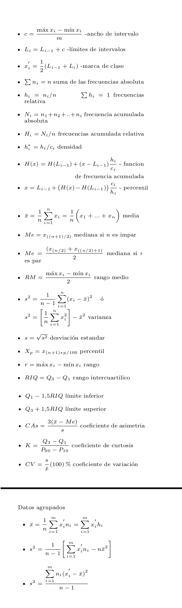

```{r setup, include=FALSE}
knitr::opts_chunk$set(comment = NA)

library(RColorBrewer)
library(summarytools)
library(knitr)
library(readxl)
library(tidyverse)
# Colombia<- readRDS("data/Colombia.RDS")
# 
# colores
c0= "#b0394a"
c1= "#ad6395"
c2= "#a391c4"
c3= "#8acfe6"
c4= "#646420"
c5= "#db524f"

tiempo=c(10.6, 10.9, 13.3, 11.5, 11.5, 9.0, 7.1, 10.8, 13.1, 8.1, 14.6, 9.4, 12.1, 7.1, 7.3, 6.8, 13.1, 10.8, 13.8, 9.6, 11.5, 6.7, 7.8, 9.7, 9.5, 7.5, 10.1, 12.7, 12.5, 7.1, 10.9, 10.6, 12.4, 10.6, 9.0, 7.5, 11.5, 7.4, 11.3, 11.8, 6.4, 2.3, 15.2, 5.4, 10.9, 8.3, 10.9, 7.9, 13.8, 11.0)
```

<br/>


```{r, echo=FALSE, out.width="100%", fig.align = "center"}
knitr::include_graphics("img/banner1.png")
```

<br/><br/>

# **Enunciado**

<br/>

Una de las principales medidas de la calidad de servicio que ofrece una organización y sus departamentos es la rapidez con la que responde a las quejas de sus clientes. El Centro de Servicios Informáticos de la Universidad está interesado en disminuir el tiempo de atención a quejas que se presentan relacionados con mal funcionamiento de las máquinas virtuales tanto para profesores, colaboradores como para estudiantes que realizan prácticas de investigación. Con el fin de estudiar el comportamiento de este indicador, selecciona una muestra de los tiempos de atención en minutos que se presentan a continuación:

<br/><br/>

# **Información**

<!-- ```{r} -->
<!-- tiempo=c(10.6, 10.9, 13.3, 11.5, 11.5, 9.0, 7.1, 10.8, 13.1, 8.1, 14.6, 9.4, 12.1, 7.1, 7.3, 6.8, 13.1, 10.8, 13.8, 9.6, 11.5, 6.7, 7.8, 9.7, 9.5, 7.5, 10.1, 12.7, 12.5, 7.1, 10.9, 10.6, 12.4, 10.6, 9.0, 7.5, 11.5, 7.4, 11.3, 11.8, 6.4, 2.3, 15.2, 5.4, 10.9, 8.3, 10.9, 7.9, 13.8, 11.0) -->

<!-- #stem(tiempo) -->

<!-- # The decimal point is at the | -->

<!-- #   2 | 3 -->
<!-- #   5 | 4 -->
<!-- #   6 | 478 -->
<!-- #   7 | 111345589 -->
<!-- #   8 | 13 -->
<!-- #   9 | 004567 -->
<!-- #  10 | 1666889999 -->
<!-- #  11 | 0355558 -->
<!-- #  12 | 1457 -->
<!-- #  13 | 11388 -->
<!-- #  14 | 6 -->
<!-- #  15 | 2 -->

<!-- cat("sum(tiempo) = ", sum(tiempo), "\n") -->
<!-- cat("sum(tiempo^2) = ",sum(tiempo^2), "\n") -->
<!-- cat("sum(tiempo-mean(tiempo)^1) = ",sum(tiempo-mean(tiempo)^1), "\n") -->
<!-- cat("sum((tiempo-mean(tiempo))^2)",sum((tiempo-mean(tiempo))^2), "\n") -->
<!-- cat("sum((tiempo-mean(tiempo))^3)",sum((tiempo-mean(tiempo))^3), "\n") -->
<!-- cat("sum((tiempo-mean(tiempo))^4)", sum((tiempo-mean(tiempo))^4), "\n") -->
<!-- ``` -->
<pre>
tiempo=c(10.6, 10.9, 13.3, 11.5, 11.5, 9.0, 7.1, 10.8, 13.1, 8.1, 14.6, 9.4, 
         12.1, 7.1, 7.3, 6.8, 13.1, 10.8, 13.8, 9.6, 11.5, 6.7, 7.8, 9.7, 9.5, 
         7.5, 10.1, 12.7, 12.5, 7.1, 10.9, 10.6, 12.4, 10.6, 9.0, 7.5, 11.5, 
         7.4, 11.3, 11.8, 6.4, 2.3, 15.2, 5.4, 10.9, 8.3, 10.9, 7.9, 13.8,11.0)

#stem(tiempo)

# The decimal point is at the |

#   2 | 3
#   5 | 4
#   6 | 478
#   7 | 111345589
#   8 | 13
#   9 | 004567
#  10 | 1666889999
#  11 | 0355558
#  12 | 1457
#  13 | 11388
#  14 | 6
#  15 | 2


sum(tiempo)  =  500.7 
sum(tiempo^2) =  5350.37 
sum(tiempo-mean(tiempo)^1)   =    3.463896e-14 
sum((tiempo-mean(tiempo))^2) =  336.3602 
sum((tiempo-mean(tiempo))^3) = -330.4283 
sum((tiempo-mean(tiempo))^4) = 6910.703 
</pre>

<br/><br/>

<!-- ```{r} -->
<!-- sort(tiempo) -->
<!-- ``` -->

La auditorı́a de la universidad desea conocer si el CentroInformático está cumpliendo con lineamietos establecidos por las normas para este tipo de servicios, dentro
de los cuales se destacan:


a. No poseer datos atı́picos.

b. No exceder las 10 minutos para la atención. Solo está permitido un 5 % de la muestra analizada.

c. Tener un 80 % de los tiempos por debajo de las 8 minutos (que equivalen a un dı́a laboral).

d. Tener una distribución con asimetrı́a positiva.

<br/><br/>

El responsable de la auditorı́a le pide revise cada uno de los lineamientos y su cumplimiento y realizar un breve informe.

<br/><br/>

# **Formulario**

```{r, echo=FALSE, out.width="70%", fig.align='left'}

```

<br/><br/>

# **Solución**

a. No posee datos atípicos

Para determinar si existen datos atípicos podemos construir un diagrama de cajas que visualiza 

