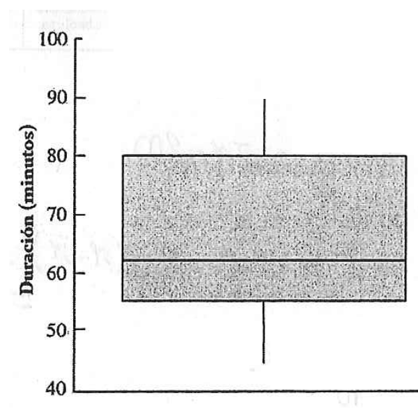

```{r setup, include=FALSE}
knitr::opts_chunk$set(comment = NA)

# Colombia<- readRDS("data/Colombia.RDS")
# 
# colores
c0= "#b0394a"
c1= "#ad6395"
c2= "#a391c4"
c3= "#8acfe6"
c4= "#646420"
c5= "#db524f"


```

<br/>


```{r, echo=FALSE, out.width="100%", fig.align = "center"}
knitr::include_graphics("img/banner1.png")
```


<br/><br/>

1. La siguiente información corresponde a los resultados obtenidos en un quiz1 presentado por los estudiantes de Probabiñidad y Estadística del periodo 2022-2

<br/>

```{r}
notas= c(3.4, 3.9, 4.0, 2.3, 3.5, 3.0, 3.7, 2.8, 3.9, 3.9, 3.7, 
2.6, 4.3, 2.8, 2.8, 4.3, 3.6, 3.0, 2.4, 2.9, 3.3, 3.6, 
3.4, 2.3, 1.9, 4.3, 2.8, 4.2, 2.8, 3.4, 4.1, 2.3)
```

<br/>

a. Suponga que usted es el estudiante que obtuvo una nota de 3.2. ¿Cómo se sitúa su nota con respecto al grupo?

<br/>

b. El director de la carrera supone que si las distribución de las notas debe tienen un comportamiento con asimetría positiva, indican que la prueba presenta un alto nivel de dificultad, mientras que si la asimetría es negativa, los resultados indican que la prueba fue relativamente fácil. Que podría decir sobre los resultados obtenidos en el quiz1 de Probabilidad y Estadística?

<br/><br/>

2. Con respecto a los datos representados en la siguiente gráfica, cual de las siguiente afirmaciones son verdaderas (V) , cuales falsas (F). En cada caso justificar su respuesta.


```{r, echo=FALSE, out.width="30%", fig.align = "center"}

```

<br/>

a. Se puede afirmar que el 80% de los que participaron en la prueba, demoraron menos de 75 minutos

<br/>

b. Muchos estudiantes gastaron poco tiempo y pocos estudiantes gastaron mucho tiempo en la realización de la prueba

<br/>

c. Ente 62 minutos y 80 minutos se presentan aproximadamente el 50% de los tiempos

<br/>

d. Ningún estudiante gasta más de 90 minutos en la prueba

<br/>

e. La variable objeto de estudio corresponde a una variable cualitativa medida en escalar de razón

<br/>

f. Una variable de interés relacionada con la prueba es el programa al que pertenece el estudiante. Esta variable es cualitativa en escala de ordinal

<br/>

g. La media es más grande que la mediana

<br/>

h. La distribución de los resultados es asimétrica negativa

<br/>

La no existencia de datos atípicos genera que la mediana este más arriba en comparación con la media

<br/><br/>

3. Una empresa distribuidora de cemento tiene cuatro locales en la ciudad. La información resumida en la siguiente tabla corresponde al número de artículos vendidos por día, en una muestra aleatoria de diez dias, procedentes de cada uno de los cuatro locales

<br/>

|Local |media     |mín         |Q1           | Q2            |   Q3        | máx       | rango       | RIQ        |
|-----:|---------:|-----------:|------------:|--------------:|------------:|----------:|------------:|-----------:|
|1     |1011      | 600        |775          |1050           |1225         |1400       |800          |450         |
|2     |1020      | 100        |275          |1050           |1725         |1900       |1800         |1450        |
|3     |1840      | 200        |1500         |2100           |2500         |2600       |2400         |1000        |
|4     |1250      | 800        |975          |1050           |1050         |2200       |1400         |500         |

<br/>

Realice una breve descripción de las ventas de la empresa a partir de la información suministrada.

<br/><br/>

4. Las tres medidas de tendencia central introducidas en la primera parte del curso son : media, mediana, el rango medio y la media truncada, para variables cuantitativas y la moda en el caso de las variables cualitativas. Una medida adicional es el cuarto medio que corresponde al promedio de Q1 y Q2.  ¿Cual o cuales de los indicadores enunciados son resistentes a los efectos de los valores atípicos?. Explique su razonamiento.

<br/><br/>

5. Una lista de diez número tiene una media de 20, una mediana de 18 y una desviación estándar de 5. El número más grande de la lista es 39.32. Accidentalmente este número se cambia por 62.7 . Si se desea corregir el error, cuales serian los valores correctos de la media, mediana y de la desviación estándar?
